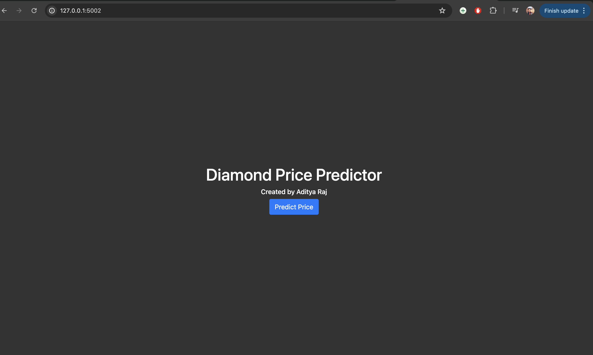
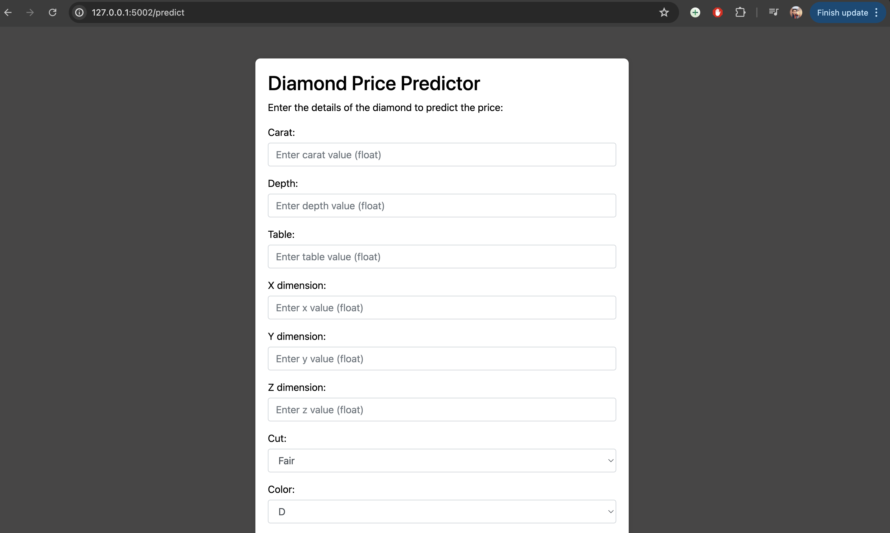

# Diamond Price Predictor

This project develops a machine learning model to predict diamond prices based on various features such as carat, depth, table, and physical dimensions (x, y, z). The model and its preprocessing pipeline are deployed as a web application using Flask.

## Project Structure

```
Diamond-Price-Predictor/
├── artifacts/
│   ├── model.pkl            # Trained model
│   ├── preprocessor.pkl     # Preprocessing pipeline
├── data/
│   ├── raw.csv              # Raw data
│   ├── test.csv             # Test dataset
│   ├── train.csv            # Training dataset
│   ├── gemstone.csv         # Additional data
├── notebooks/
│   ├── EDA.ipynb            # Exploratory Data Analysis
│   ├── Model Training.ipynb # Notebook for training models
├── src/
│   ├── components/          # Modular components of the application
│   ├── pipelines/           # Data processing and ML pipelines
│   ├── exception.py         # Exception handling module
│   ├── logger.py            # Logging module
│   ├── utils.py             # Utility functions
├── templates/
│   ├── form.html            # HTML form for input data
│   ├── index.html           # Main page of the web application
├── ScreenShot/              # Directory containing screenshots of the application
│   ├── SS1.png
│   ├── SS2.png
│   ├── SS3.png
├── .gitignore               # Specifies intentionally untracked files to ignore
├── README.md                # README file for project documentation
├── application.py           # Flask application entry point
├── requirements.txt         # List of dependencies
├── setup.py                 # Setup script for the application
```

## Installation

To set up this project locally, follow these steps:

1. Clone the repository:
   ```
   git clone https://github.com/your-username/Diamond-Price-Predictor.git
   ```
2. Navigate to the project directory:
   ```
   cd Diamond-Price-Predictor
   ```
3. Install dependencies:
   ```
   pip install -r requirements.txt
   ```

## Usage

To run the Flask application:
```
python application.py
```
Visit `http://127.0.0.1:5002` to access the application.

## Features

- **Predictive Modeling:** Utilizes Scikit-Learn for building a regression model to estimate diamond prices.
- **Data Visualization:** Notebooks include EDA with libraries like Seaborn and Pandas.
- **Web Interface:** Flask application for easy interaction with the predictive model.

## Screenshots

Here are some screenshots of the application:





## Contributing

Contributions are welcome. Please open an issue first to discuss what you would like to change.

Please make sure to update tests as appropriate.

## About the Creator

This project was developed by **Aditya Raj**, a passionate software developer and data science enthusiast. Aditya has a keen interest in machine learning, data analysis, and building intuitive and impactful software solutions. For more projects and collaborations, reach out via [LinkedIn]([https://www.linkedin.com/in/aditya-raj-05411b21a/]).

## License

[MIT](https://choosealicense.com/licenses/mit/)

